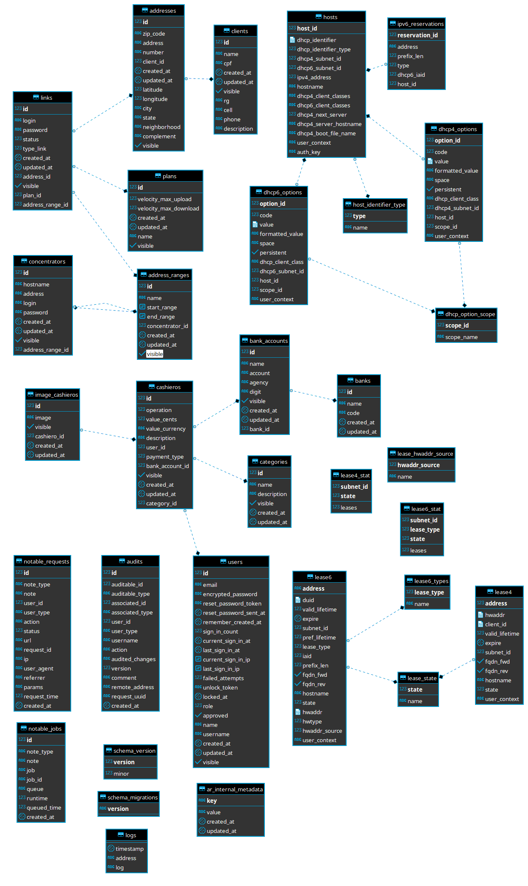

# mycroft-for-us

Sistema para gerenciamento de ISP baseado em mikrotik versão 6.+ .

Suporte a:
* Hotspot
* PppoE
* Dhcp (option 82) AAA
* Múltiplos concentradores
* Vouchers

Caraterísticas:
* Baseado em container
* Suporte a logs em Redis
* Base de dados padrão - Postgresql
* Totalmente responsivo

#### Wiki
`Instalação e demais procedimentos acesse [AQUI](https://github.com/jdruk/mycroft-for-us/wiki/Instala%C3%A7%C3%A3o) 

##### UML

(Formato DIA UML)
arquivo:	uml_diagram_class.dia
